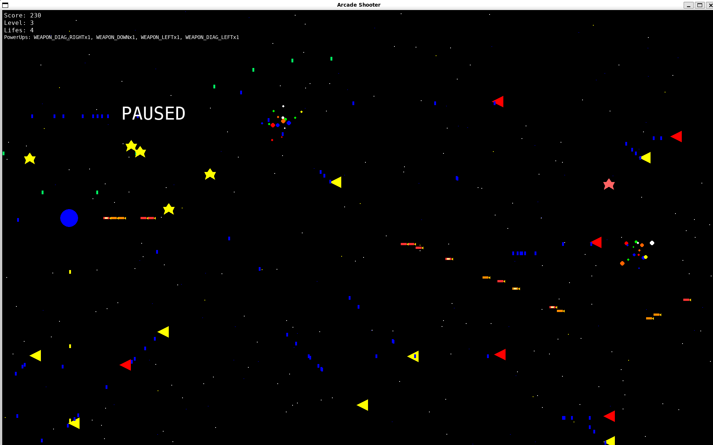
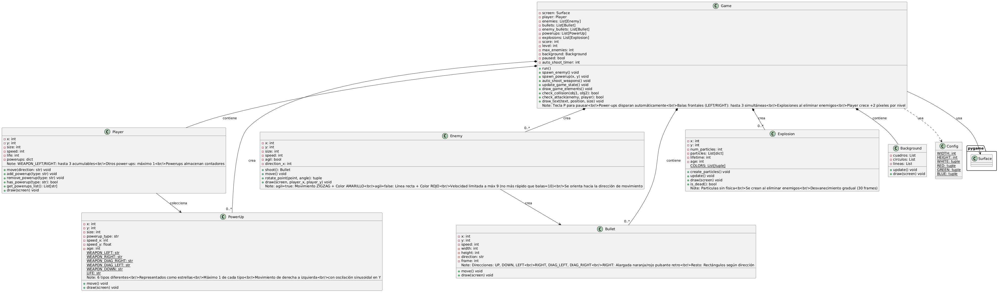

# SpaceDementia - Arcade Shooter

## Descripción
**SpaceDementia** es un juego de disparos estilo arcade retro desarrollado en Python con Pygame. El jugador controla una nave ubicada en el lado izquierdo de la pantalla, disparando hacia enemigos que avanzan desde la derecha. El juego utiliza una orientación horizontal (derecha a izquierda) con mecánicas de progresión, power-ups variables y efectos visuales retro de los 80s.

<div align="center">
  
</div>
 
## 🎮 Características Principales

### Movimiento y Control
- **4 direcciones de movimiento**: Arriba, Abajo, Izquierda, Derecha (Teclas de flecha)
- **Disparos principales**: Hacia la derecha con animación retro pulsante naranja/rojo
- **Posición inicial**: Centro izquierdo de la pantalla (x=40, y=HEIGHT/2)
- **Pausa**: Presionar `P` para pausar/reanudar el juego

### Sistema de Niveles y Dificultad
- **Timer por nivel**: Cada nivel dura 2 minutos (configurable via `LEVEL_DURATION` en config.py)
- **Contador regresivo**: Se muestra en pantalla en formato `MM:SS`, se pone rojo en los últimos 10 segundos
- **Escalado de enemigos**: 
  - Mayor cantidad: `5 + 3×nivel` enemigos simultáneos
  - Enemigos ágiles: 30% en nivel 1 → 100% en nivel 5+
  - Velocidad aumenta: `5 + (nivel-1)×0.5` px/frame
- **Crecimiento del jugador**: +2 píxeles de tamaño por nivel completado
- **Vida adicional**: +1 vida al subir de nivel

### Jefe Final (Boss)
- **Aparición**: Al terminar el timer del nivel (cuenta regresiva llega a 0)
- **Forma**: Cubo rojo grande con borde amarillo y núcleo naranja
- **Vida**: 500 HP base (escala +50 HP por nivel), balas hacen 5 de daño
- **Barra de vida**: Se muestra en la parte superior centrada al aparecer el boss
- **Comportamiento**:
  - Se posiciona en el lado derecho de la pantalla
  - Se mueve arriba/abajo suavemente (sin saltos bruscos)
  - Ocasionalmente carga hacia la izquierda (embestida) y luego vuelve a su posición
  - Dispara 3 balas simultáneas hacia la izquierda cada 20 frames
- **Subditos**: Hasta 3 enemigos normales aparecen junto al boss cada ~3 segundos
- **Victoria**: Al derrotar al boss se sube de nivel y se reinicia el timer

### Sistema de Power-ups
7 tipos de power-ups coleccionables (representados como estrellas):

| Tipo | Color | Efecto | Stack |
|------|-------|--------|-------|
| **WEAPON_LEFT** | Azul | Dispara balas a la izquierda automáticamente | ✅ Hasta 3 |
| **WEAPON_RIGHT** | Azul | Dispara balas a la derecha automáticamente | ✅ Hasta 5 |
| **WEAPON_DIAG_LEFT** | Amarillo | Dispara en diagonal superior izquierda | ❌ Máximo 1 |
| **WEAPON_DIAG_RIGHT** | Amarillo | Dispara en diagonal superior derecha | ❌ Máximo 1 |
| **WEAPON_UP** | Cian | Dispara hacia arriba | ❌ Máximo 1 |
| **WEAPON_DOWN** | Verde | Dispara hacia abajo | ❌ Máximo 1 |
| **LIFE** | Rosa | Recupera 1 vida | ❌ Máximo 1 |

**Mecánicas de power-ups:**
- Movimiento: Flotan de derecha a izquierda con oscilación sinusoidal suave
- Spawn: 50% de probabilidad al destruir un enemigo
- Auto-disparo: Cada 10 frames con power-ups activos
- Pérdida: Tu nave pierde un power-up aleatorio antes de perder vidas

### Enemigos
**Tipos:**
- **Normales (Rojo)**: Movimiento lineal derecha→izquierda
- **Ágiles (Amarillo)**: Movimiento en zigzag vertical (erráticos)

**Comportamiento:**
- Velocidad limitada: Máximo 9 px/frame (balas enemigas = 10)
- Orientación: Triángulos apuntando hacia su dirección de movimiento
- Disparo: Balas azules hacia el jugador cada frame
- Eliminación: Generan explosión con 16 partículas y efecto fade

### Balas y Proyectiles
**Bala principal (RIGHT):**
- Forma: Alargada retro (16×6 px) con punta triangular dorada
- Animación: Pulsa entre naranja y rojo cada 3 frames
- Efecto: Brillo intermitente cada 6 frames (estilo arcade 80s)
- Velocidad: 20 px/frame
- Cantidad: 1-3 simultáneas según power-ups

**Otras direcciones:**
- UP, DOWN, LEFT, DIAG_LEFT, DIAG_RIGHT
- Rectángulos simples con colores distintivos
- Velocidad: 20 px/frame (cardinal) / 15 px/frame (diagonal)

### Efectos Visuales
**Explosiones:**
- 16 partículas por enemigo destruido
- Colores aleatorios: Rojo, amarillo, verde, azul, blanco, naranja
- Duración: 30 frames con desvanecimiento progresivo
- Física: Movimiento lineal sin aceleración

**Fondo animado:**
- 4 capas de profundidad (cuadros, círculos, líneas, partículas)
- Elementos distribuidos en pantalla desde el inicio
- Velocidad y densidad escalan con el nivel (1-5+)
- Colores varían por nivel (azul, cian, verde, magenta)
- Efecto paralaje retro con movimiento diagonal

### Interfaz
**HUD en pantalla:**
- Puntuación actual
- Nivel actual
- Vidas restantes
- Power-ups activos (con contadores: `WEAPONxN`)
- Mensajes: Pausa, Game Over

## ¿Cómo Jugar?

### Controles
| Acción | Tecla |
|--------|-------|
| Mover Arriba | ⬆️ Flecha Arriba |
| Mover Abajo | ⬇️ Flecha Abajo |
| Mover Izquierda | ⬅️ Flecha Izquierda |
| Mover Derecha | ➡️ Flecha Derecha |
| Disparar | Espacio |
| Pausar/Reanudar | P |
| Salir | Q o ESC |

### Estrategia
1. **Recoge power-ups**: Flota en patrón sinusoidal, apúntalos
2. **Acumula balas**: Consigue 3× WEAPON_RIGHT para lluvia de proyectiles
3. **Aprovecha crecimientos**: Tu nave crece con niveles, protegiendo mejor
4. **Esquiva enemigos ágiles**: Los amarillos zigzaguean impredeciblemente
5. **Mantén las vidas**: Pierdes power-ups al colisionar antes de perder vida

## 🏗️ Arquitectura del Juego

### Clases Principales

**Game**
- Controlador central del juego
- Gestiona: spawn de enemigos, colisiones, estado, renderizado, timer y boss
- Coordina: Player, Enemy, Boss, Bullet, PowerUp, Explosion, Background

**Player**
- Posición y tamaño dinámico (crece con niveles)
- Sistema de power-ups (contadores para LEFT/RIGHT, máximo 1 para otros)
- Movimiento 4-direccional restringido por pantalla

**Enemy**
- Dos variantes: Normal (rojo/línea recta) y Ágil (amarillo/zigzag)
- Velocidad limitada a 9 px/frame
- Triángulo rotado según dirección de movimiento
- Dispara balas LEFT cada frame

**Boss**
- Jefe final: cubo rojo con IA de movimiento (vertical + embestida)
- Barra de vida en pantalla, escala por nivel
- Dispara rafagas de 3 balas

**Bullet**
- 6 direcciones soportadas: UP, DOWN, LEFT, RIGHT, DIAG_LEFT, DIAG_RIGHT
- Contador de frames para animaciones retro
- Removido al salir de pantalla

**PowerUp**
- 7 tipos (incluyendo LIFE)
- Movimiento sinusoidal (derecha a izquierda con oscilación Y)
- Colores distintivos por tipo
- Max 1 activo por tipo (LEFT acumula hasta 3, RIGHT hasta 5)

**Explosion**
- Sistema de partículas sin física
- 16 partículas con fade progresivo

**Background**
- 4 capas paralelas animadas (cuadros, círculos, líneas, partículas)
- Elementos distribuidos en toda la pantalla al iniciar
- 5 variaciones visuales por nivel

## ⚙️ Requisitos
- Python 3.11+
- Pygame 2.6.1+
- SDL 2.28.4+ (incluido en Pygame)

## 🚀 Instalación y Ejecución

### 1. Clonar repositorio
```bash
git clone <repository>
cd SpaceDementia
```

### 2. Crear entorno virtual (recomendado)
```bash
python -m venv env
source env/bin/activate  # En Windows: env\Scripts\activate
```

### 3. Instalar dependencias
```bash
pip install -r requirements.txt
```

O directamente:
```bash
pip install pygame==2.6.1
```

### 4. Ejecutar juego
```bash
python src/main.py
```

## 📊 Diagrama UML
Se incluye `diagram.puml` con documentación PlantUML de todas las clases y sus relaciones.

<div align="center">
  
</div>

**Estructura de relaciones:**
```
Game (central) contiene:
├── Player x1
├── Enemy x0..*
├── Boss x0..1
├── Bullet x0..*
├── PowerUp x0..*
├── Explosion x0..*
├── Background x1
└── Config (constantes)
```

Visualiza el PlantUML en [PlantUML Online Editor](http://www.plantuml.com/plantuml/uml/) para exploración interactiva.

## 🎨 Resolución y Pantalla
- **Resolución**: 1920×1200 píxeles (fullscreen HD 16:10)
- **Orientación**: Horizontal (derecha ← izquierda)
- **FPS**: 30 frames por segundo (limitado por Pygame clock)

## 📝 Especificaciones Técnicas

### Colisión
- Sistema AABB (Axis-Aligned Bounding Box)
- Rectángulos de colisión basados en atributos de objeto
- Detección genérica con `hasattr()` para diferentes tipos

### Puntuación
- +10 puntos por enemigo eliminado
- +2 puntos por destruir bala enemiga
- Requisito para siguiente nivel: `puntuación ≥ nivel × 100`
- Al subir nivel: Puntuación resetea a 0, aumenta dificultad

### Vidas
- Inicial: 3 vidas
- Pérdida: Por colisión con enemigo (pierde power-ups antes)
- Recuperación: +1 por LIFE power-up, +1 por nivel

## 🐛 Notas Técnicas
- Velocidad de enemigos limitada a 9 para evitar penetración de balas (10)
- Power-up LEFT puede acumular hasta 3, RIGHT hasta 5, distribuidos verticalmente
- Explosiones generan offset aleatorio para mejor visualización
- Todas las constantes centralizadas en `config.py` para fácil rebalancing

## 📄 Archivos del Proyecto
```
SpaceDementia/
├── src/
│   ├── main.py        # Punto de entrada
│   ├── config.py      # Constantes (WIDTH, HEIGHT, colores)
│   ├── game.py        # Lógica central del juego
│   ├── player.py      # Clase jugador
│   ├── enemy.py       # Clase enemigo
│   ├── bullet.py      # Clase proyectil
│   ├── powerup.py     # Clase power-up
│   ├── boss.py        # Jefe final (cubo con IA)
│   ├── explosion.py   # Sistema de partículas
│   └── background.py  # Fondo animado
├── diagram.puml       # Documentación UML
├── requirements.txt   # Dependencias Python
└── README.md          # Este archivo
```

## 🎓 Créditos
Desarrollado como proyecto arcade retro en Python/Pygame.

## 📜 Licencia
Usar libremente con atribuciónreference.

```bash
git clone https://github.com/JoseThD/FinalProgramacion.git
```
Luego accede a al repositorio
```
cd tu-carpeta-del-proyecto
```
```
python3 main.py 
```
## Contribuciones
Este proyecto es de creación propia y se deja libre para su uso y distribución. Sin embargo, si deseas realizar modificaciones en el código o contribuir con mejoras, por favor, envía una solicitud previa a los siguientes correos para obtener la aprobación.

```
juannavarro139070@correo.itm.edu.co
```


Estamos abiertos a ideas y sugerencias para mejorar el juego, pero nos gustaría mantener un registro y control sobre los cambios realizados. ¡Tus contribuciones son bienvenidas y apreciadas!


## Licencia
Este proyecto es de libre uso, pero cualquier modificación requiere aprobación previa. Para más detalles, contacta a los autores.

